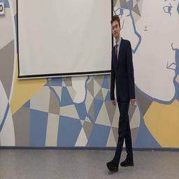
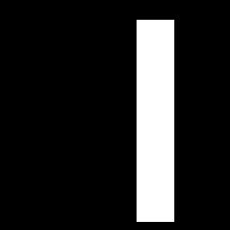

# shadowhunt

Нейронная сеть, построенная на основе сверточной нейронной сети U-Net для локализации людей в реальном времени

Для обучения модели необходимо запустить файл **main.py**. Набор данных находится в папке **date**, он был сгенерирован вручную. Инструменты для работы с набором данных называются **resizer.py** и **mask_creator.py**. для тестирования сети вы можете запустить файл **test.py**, а для тестирования в режиме реального времени вам необходимо запустить **Show.py**. Обученная модель хранится в папке **model**.

Вы можете скачать обученную модель по ссылке: https://drive.google.com/drive/folders/1ByMH0K_IVUE4aCRbaOH50WY1-Sgnbarj?usp=drive_link оба файла должны быть помещены в папку model в корневом каталоге

Пример фото из датасета:

<kbd>
  
  
</kbd>

Пример локализации на датасете:

<kbd>
  
  
  
</kbd>

# Архитектура:

