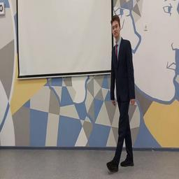
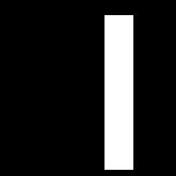

# shadowhunt

> Нейросеть на базе U-Net для семантической сегментации и локализации людей на изображениях в реальном времени. Проект разработан в рамках хакатона НТЦ «КАМАЗ» и занял призовое место.

## Запуск

Для обучения модели необходимо запустить файл **main.py**. Набор данных находится в папке **date**, он был сгенерирован вручную. Инструменты для работы с набором данных называются **resizer.py** и **mask_creator.py**. для тестирования сети вы можете запустить файл **test.py**, а для тестирования в режиме реального времени вам необходимо запустить **Show.py**. Обученная модель хранится в папке **model**.

Вы можете скачать обученную модель по ссылке: https://drive.google.com/drive/folders/1ByMH0K_IVUE4aCRbaOH50WY1-Sgnbarj?usp=drive_link оба файла должны быть помещены в папку model в корневом каталоге

## Особенности

- **Архитектура**: U-Net с skip connections для точной локализации границ
- **Функция потерь**: Комбинация Dice Loss + Binary Crossentropy для баланса точности и стабильности
- **Метрика**: Dice coefficient для оценки качества сегментации
- **Аугментация**: Случайные повороты (±20°), отражения для улучшения обобщающей способности
- **Оптимизация**: tf.data pipeline с кэшированием и предзагрузкой для эффективного обучения

## Пример датасета
| Входное изображение | Маска |
|--------------------|-------------------|
|||

## Пример локализации на датасете

| Входное изображение | Предсказание модели | Итог |
|---------------------|---------------------|------|
|  |  |  |
|  |  |  |

## Архитектура:

